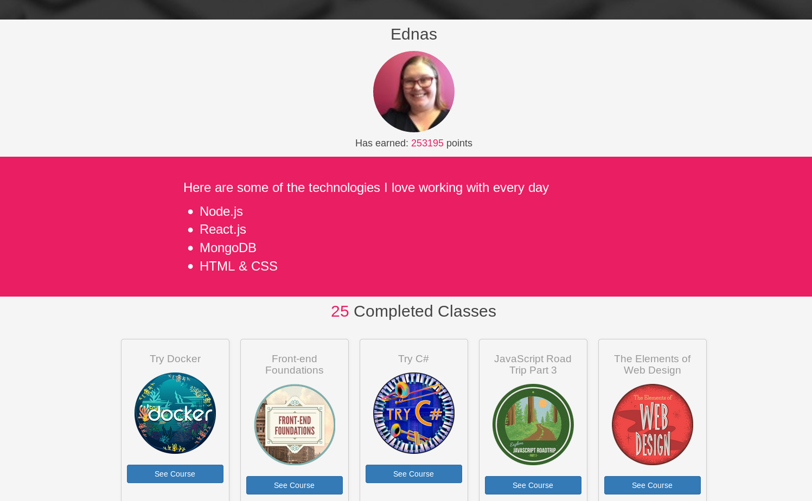

# jQueryProject

I am displaying information about my progress in the online coding development platform CodeSchool using AJAX requests and jQuery and for the CSS I am using Bootstrap and Flexbox as well as custom styles.

View the completed project on my portfolio at http://jquerybadges.edna.tech/

Feel free to fork this project to use with your own CodeSchool progress, just make sure to change the relevant data to your own.

```
CodeSchool.com has been acquired by Pluralsight and the CodeSchool API no longer works to make the AJAX calls. Unfortunately the link now shows empty divs.
```

